# ResumeGuide

AI-powered Resume Analysis Platform that helps job seekers evaluate resumes against job descriptions, identify skill gaps, improve ATS compatibility, and receive personalized learning recommendations.

---

## Demo


---

## Features

### Resume Management

* Upload and manage multiple resumes
* Secure resume storage using Amazon S3
* Resume history and tracking

### ATS Analysis

* ATS score calculation
* Keyword matching analysis
* Skill gap identification
* Resume quality assessment
* Missing skills detection

### Career Guidance

* Personalized learning roadmap
* Project recommendations
* Certification recommendations
* Career improvement suggestions

### Authentication & Security

* JWT-based authentication
* Google OAuth login
* Password reset via OTP
* Protected API endpoints

### Cloud & DevOps

* Dockerized application
* CI/CD with GitHub Actions
* Container registry using Amazon ECR
* Deployment using Amazon ECS (EC2 Launch Type)
* PostgreSQL database hosted on a dedicated EC2 instance
* Resume storage using Amazon S3

---

# Architecture

## 1. User Request Flow

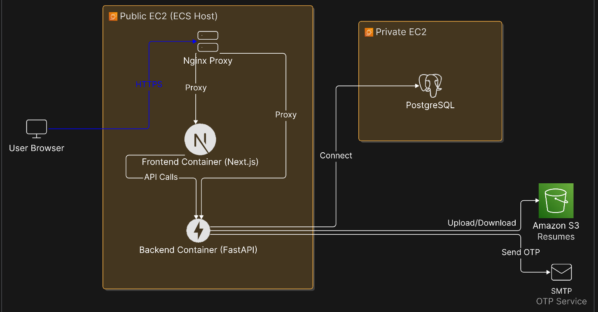

This diagram illustrates how users interact with the application and how requests travel through the system.

---

## 2. CI/CD Pipeline

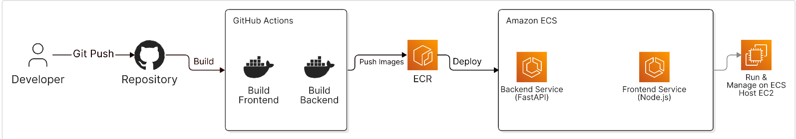

Deployment Flow:

Developer → GitHub Repository → GitHub Actions → Amazon ECR → Amazon ECS

GitHub Actions automatically builds Docker images for the frontend and backend, pushes them to Amazon ECR, and deploys updated containers to ECS.

---

## 3. AWS Infrastructure

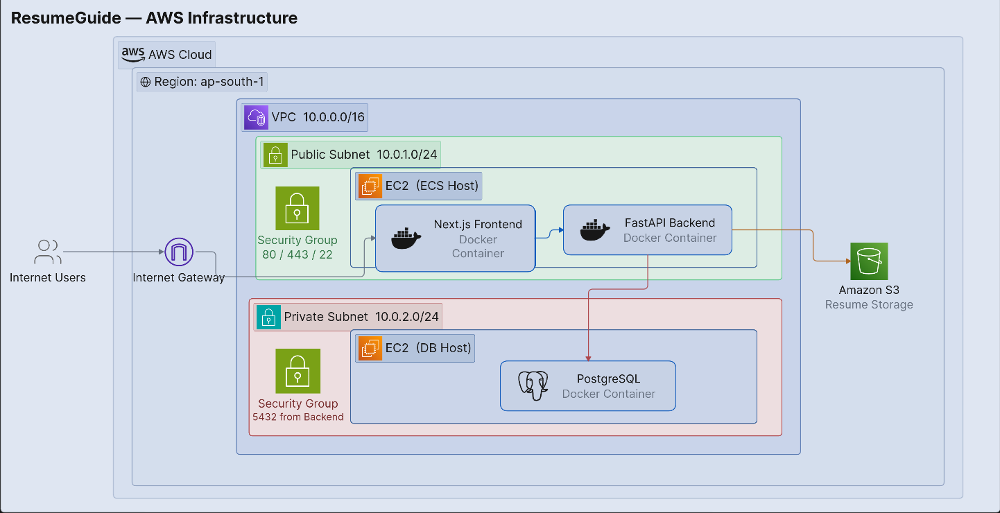

Infrastructure Components:

* AWS VPC
* Public Subnet
* Private Subnet
* ECS Host EC2 Instance
* Next.js Frontend Container
* FastAPI Backend Container
* PostgreSQL Container on Dedicated EC2
* Amazon S3 Resume Storage
* Security Groups
* Internet Gateway

---

# Screenshots

## Landing Page

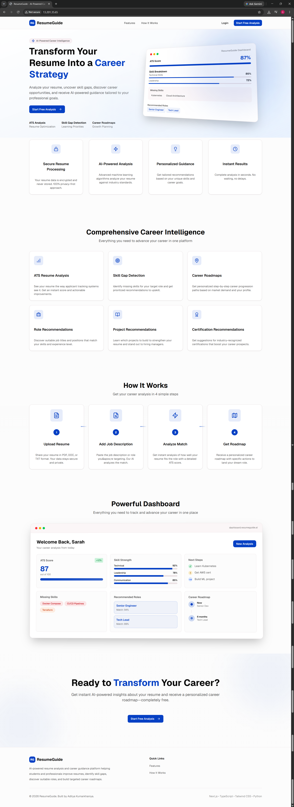

---

## Registration Page

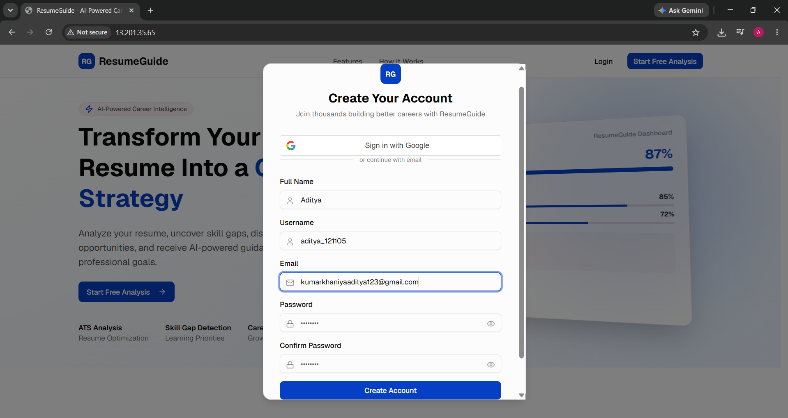

---

## Login Page

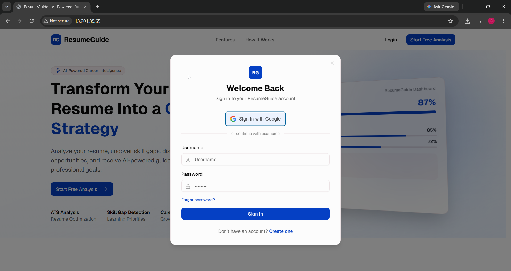

---

## Dashboard

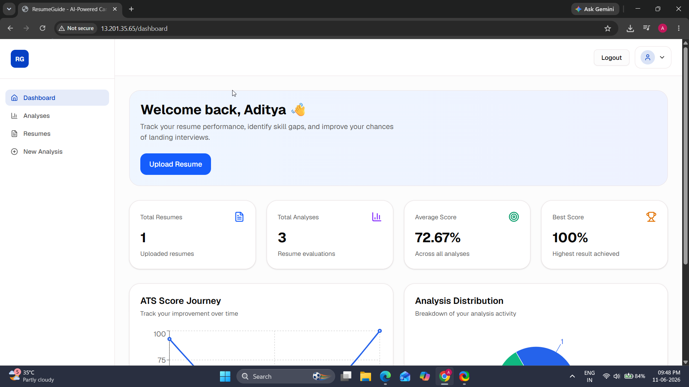

---

## My Resumes

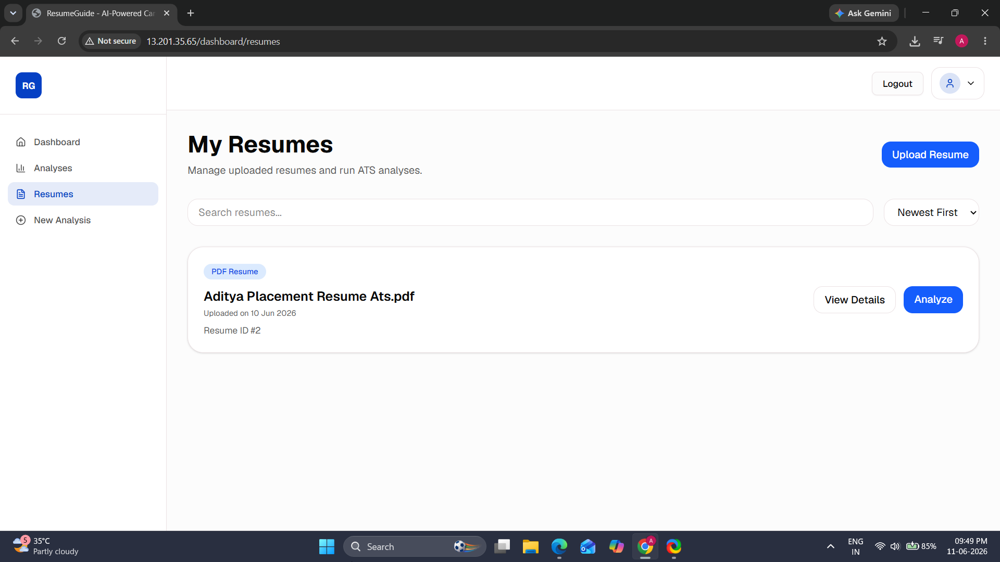

---

## Resume Upload

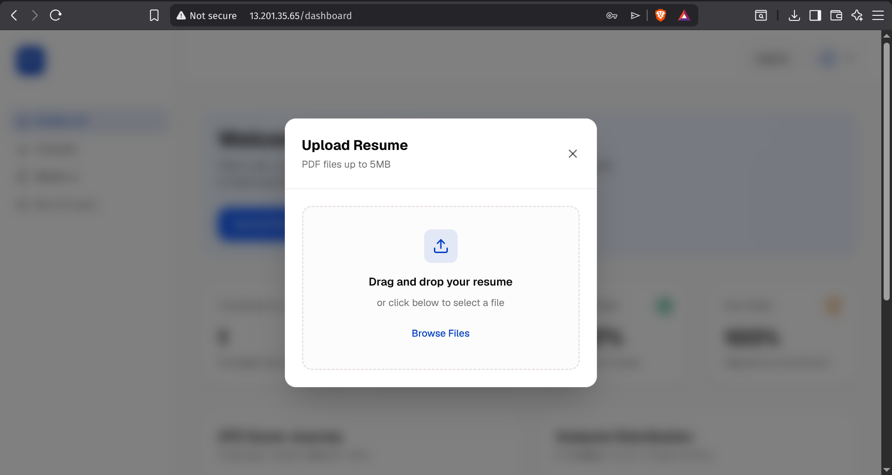

---

## Resume Details

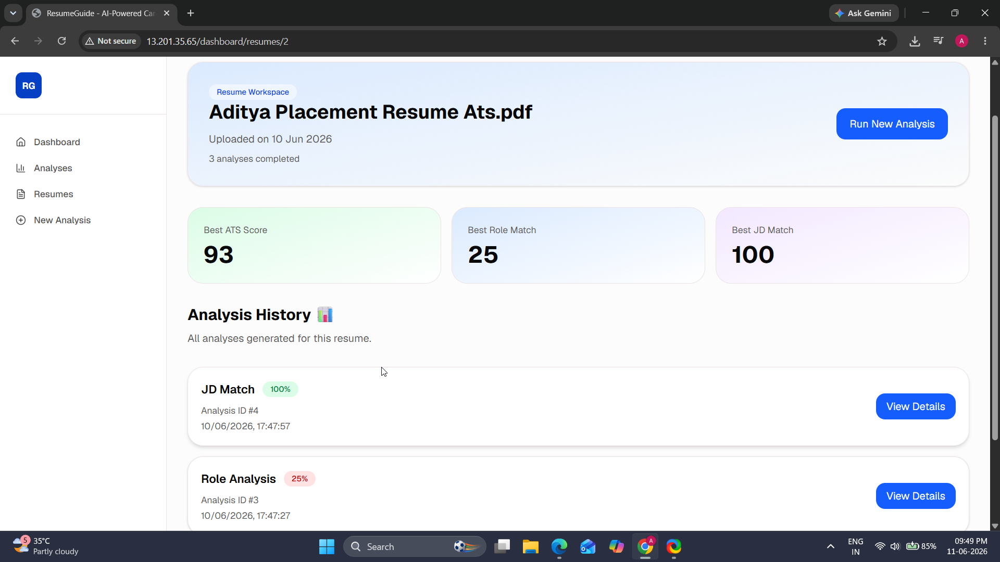

---

## Total Analysis

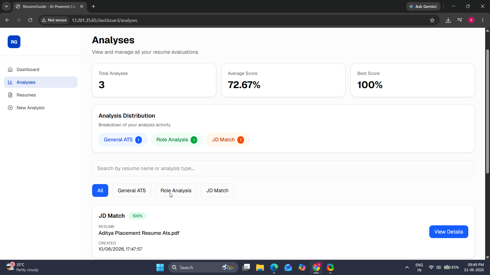

---

## ATS Analysis Demo


---

# Tech Stack

## Frontend

* Next.js
* TypeScript
* Tailwind CSS
* Axios

## Backend

* FastAPI
* Python
* SQLAlchemy
* JWT Authentication
* Pydantic

## Database

* PostgreSQL

## Cloud & DevOps

* AWS ECS
* AWS ECR
* AWS EC2
* AWS S3
* Docker
* GitHub Actions
* Nginx

## AI / NLP

* Sentence Transformers
* NLP-based Resume Analysis
* Skill Matching Engine
* ATS Scoring Logic

---

# Project Structure

```text
resumeguide/
│
├── backend/
│   ├── app/
│   ├── requirements.txt
│   └── Dockerfile
│
├── frontend/
│   ├── app/
│   ├── components/
│   └── Dockerfile
│
├── docs/
│   ├── architecture/
│   └── images/
│
├── docker-compose.yml
├── .env.example
└── README.md
```

# Local Setup

## Prerequisites

* Python 3.11+
* Node.js 20+
* PostgreSQL
* Docker
* Docker Compose

---

## Clone Repository

```bash
git clone https://github.com/aditya-121105/resumeguide.git
cd resumeguide
```

## Configure Environment Variables

```bash
cp .env.example .env
```

Update values inside `.env`.

---

## Start Application

```bash
docker compose up --build
```

Application URLs:

Frontend:

```text
http://localhost:3000
```

Backend:

```text
http://localhost:8000
```

Swagger Documentation:

```text
http://localhost:8000/docs
```

---

# Environment Variables

Create a `.env` file based on `.env.example`.

Required configurations include:

```env
DATABASE_URL=
SECRET_KEY=
GOOGLE_CLIENT_ID=
AWS_ACCESS_KEY_ID=
AWS_SECRET_ACCESS_KEY=
AWS_REGION=
SMTP_EMAIL=
SMTP_PASSWORD=

```

Do not commit actual secrets to GitHub.

---

# Deployment

ResumeGuide uses a containerized AWS deployment strategy.

Deployment Flow:

1. Developer pushes code to GitHub.
2. GitHub Actions builds frontend and backend Docker images.
3. Images are pushed to Amazon ECR.
4. Amazon ECS pulls the latest images.
5. ECS updates running containers.
6. PostgreSQL runs on a dedicated EC2 instance.
7. Resume files are stored in Amazon S3.

---

# Security

* JWT Authentication
* Password Hashing
* Protected API Endpoints
* Environment Variable Based Secrets
* S3-Based File Storage
* Private Database Access
* Security Group Restrictions

---

# Future Improvements

* Production-ready custom domain
* HTTPS using ACM and Load Balancer
* Production Google OAuth configuration
* Advanced analytics dashboard
* Background processing with queues
* Multi-resume comparison
* AI-powered resume rewriting
* Real-time job matching

---

# Author

**Aditya Kumarkhaniya**

GitHub:

https://github.com/aditya-121105

---

# License

This project is intended for educational, learning, and portfolio purposes.
